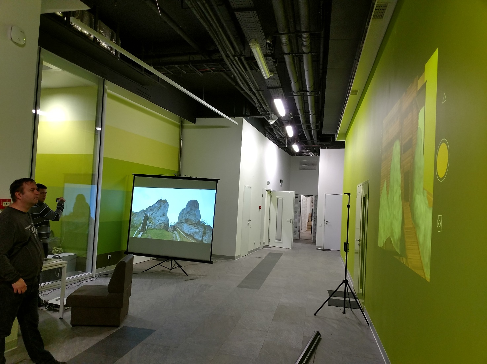

# Tustan AR

By Teodor Romanus, Semen Frish, Research Engineers

## Abstract

The app is a kind of time machine. It take back wooden castle existed in IX-XVI centuries. It was a customs on the road through Carpathian Mountains.

Mykhaylo Rozhko has found traces on the rocks nearly 50 years ago when he first came to Urych to special place where humans creatively augmented the nature. The idea to reconstruct the castle came became a  dream that his son Vasyl Rozhko is supporting now.

It came a long story of measurements and refinement. Reconstruction has been started from manual measurement of about 4000 locations where wooden planks were placed on the stones in 1971-1977. The first scientific baked graphic reconstruction was made with pencil on paper based on known architecture sample of the time some wooden remains with accuracy up to 90%. In the most developed 5th building period in XIII century it was up to 5 floors 3,5 - 5 meters high each – 25 m total. Technology evolved, laser distance measurement has became accessible and measurements were performed again. It was not enough again. Some parts of the rocks are not accessible, because they are covered with trees. Drones helped to reach that places and photogrammetry reconstruction provided centimeters to millimeters accuracy. That way were achieved both stones and castle models in modern computer graphics understanding. Matching and putting into mobile devices that workout door in different weather conditions was a year long technological challenge for SoftServe R&D team. Now It comes alive in real time on historical site outdoor and can be reviewed indoor with images placed with app in App Store and Play Market.

Nowadays we can rebuild or even 3D print full-scale castle and it’s not going to be the authentic one. Thus the dream achieved valued side effect. It clearly appeared that the rocks are also being destroyed in time and we can save this legacy.

With augmented reality curious minds can feel the cultural historical phenomena. We should know who we were to go confidently to brighter future.

## Keywords

 Tustan, Augmented Reality, AR, Structure form motion, Reconstruction, Cutting Edge, Culture, Historical Place, Education, Tourism

 ## Intro into the Tech
 
 Augmented Reality is trending now. Recent Apple move with ARKit has triggered the industry. 300+ millions of AR ready devices sounds like it is time to point exactly as it was with Zuckerberg’s Oculus 2 Billion deal 2 years ago for Virtual Reality industry.

 Augmented Reality was most likely Enterprise first. Huge potential of consumer mobile devices client base may change this statement and become Enterprise activated at once. Google Glass Enterprise edition is now available to purchase. Other tech giants on consumer level responded immediately: Google Tango accepted the challenge, Microsoft showed lead positions and a lot of small tech companies go much faster in the new race/tech battlefield. Competition is always good for industry, developers and end users.

 Industrial and Retail uses are promoted as default use cases for AR. Google claims that the tech will totally change “Your shopping experience and You’ll never be lost in Retail store again” with Tango enabled device. From businesses perspective, Retail is going to be strongly enhanced in the mall and in warehouse, on assembling and logistics line and for sure in staff training.

 According to National Association of Realtors research, Real Estate is the most promising direction: it will save Real Estate agents and clients’ time, AR/VR tours will put the "real" in Real Estate, it adds reality to what seems otherwise intangible; buyers will narrow their options with fewer showings.

 ## Research purpose 
 
 Augmented Reality (AR) may be considered as something very basic, but actually, it is a general booming tech, cutting edge of computer graphics and computer vision.Outdoor AR is not yet completely solved problem. Tasks like scene segmentation to detect sky are not yet solved with production level quality without use of additional equipment like lidars. SoftServe R&D made research, localized and solved the problem for current extreme conditions of non-uniform topology and geometry, changing weather and environment conditions. We implemented visual object reconstruction, matching and augmentation in real-time with mainstream smartphones for outdoor object under complex lighting conditions with use just camera and motion sensors of the smartphone.

 Tustan Castle appeared to be one of the most complicated and challenging tasks in this area. From one side, there is a lot of data that had been gathered for ages in terms of computer era. From the other side, that data lack core features that are used currently for recognition and matching in Augmented Reality and general architectural and historical digital reconstruction.

 Firstly, there is no Castle for now and it leads to unique situation. We just have exact places where wooden blocks where on the rocks and exact reconstruction from it. Secondly, the terrain is notsimilar to traditional historical sites in cities with lots of straight lines. Thirdly, we have direct sunlight against the camera on main excursion site half of active time. Finally, all weather changes minute to minute and season changes causes up to 100% of the image change in some places.

 SoftServe R&D team got a classic research task: a lot of data, new tech to experiment with, none of commercial or open source tech claimed to work under such conditions yet.

 Naturally, everybody tries to find the easiest way to handle the task. We reviewed existing solutions, Vuforia in particular, claimed as the world most widely developed and spread AR Platform, so we started using it. It appeared to work perfect with visual marker on the known location and with hard QR code style marker printed or screened.

 At this point, the predefined known tech nearly finished. We’ve used several more proprietary andopen source solutions but had to set a workflow from the core math and ground up.

 ## Execution 
 
 In plain and in short we needed to match stones generated from photos, stones in real environment and stones on provided 3D model.

 Afterwards it appeared that we need making, special shading and scene segmentation to achieve proper visual results.

 There are many parameters of camera and model, like the focal length, sensor size, lens distortion, scale and rotation. We had no chance to guess them or match quickly and precisely.  Here came the math stepped in.

 First, we used BLAM (kind of SLAM Simultaneous localization and mapping), reconstruction plugin for Blender to get some data and get familiar with a problem. Next, we used built in Blender’s reconstruction tools. It worked perfectly and as was mentioned above, we didn’t have anylong straight lines and had no infinite time to search for the points manually.

 After additional research of more approaches like OpenCV camera pose reconstruction, laser scan with LAStools (which turned out to be photogrammetry after all) and photogrammetry technics with MeshLab, we came to conclusion that it would work best.

 Actually, it took 6-8 iterations, 5 + 2 days of processing on the latest iteration and 25GB of temporary data. Use of structure from motion and multi view stereo algorithms from Photo Tourism used in Google Street View to get the model that showed us camera parameters, photo position in space, model transformation.

 For example, we took a point, it looked like a nice point to use as a marker and to look from at the castle, from reconstruction data we could see that the point is cool and on site, it appeared out of reach for tourists.

 While experimenting we got an idea that we could get rid of hard defined markers and did it with Google Tango, Wikitude SLAM, ARKit, Vuforia continuous tracking and more CG, CV, AI/ML techs.

 ## Result 
 
 Tustan is an amazing phenomena and its unique ancient data is a perfect match for today’s cutting edge tech such as AR. We’ve added multi time of the day and multi time of the year points to learning data set, aligned, masked. The mobile application we created, works stable now at high-end phones, including iPhones 5+, Galaxy Note5, Moto Z and Redmi 4 under the worst lighting conditions.